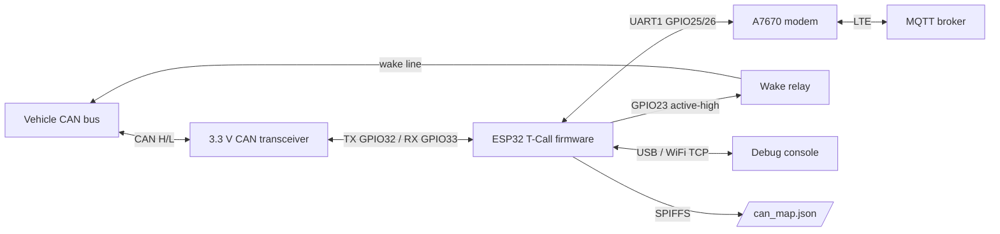
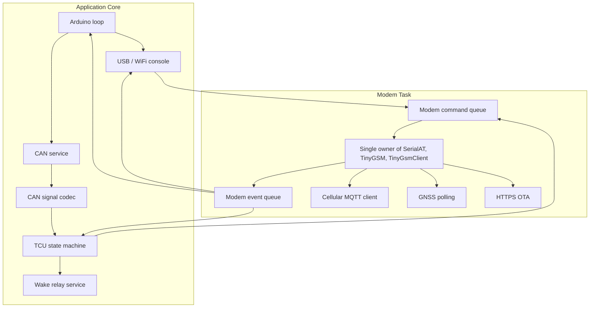
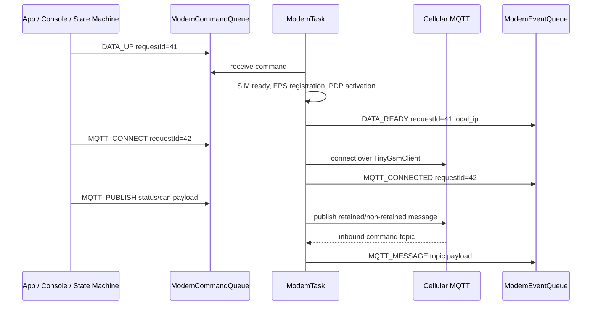
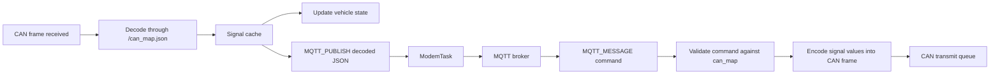
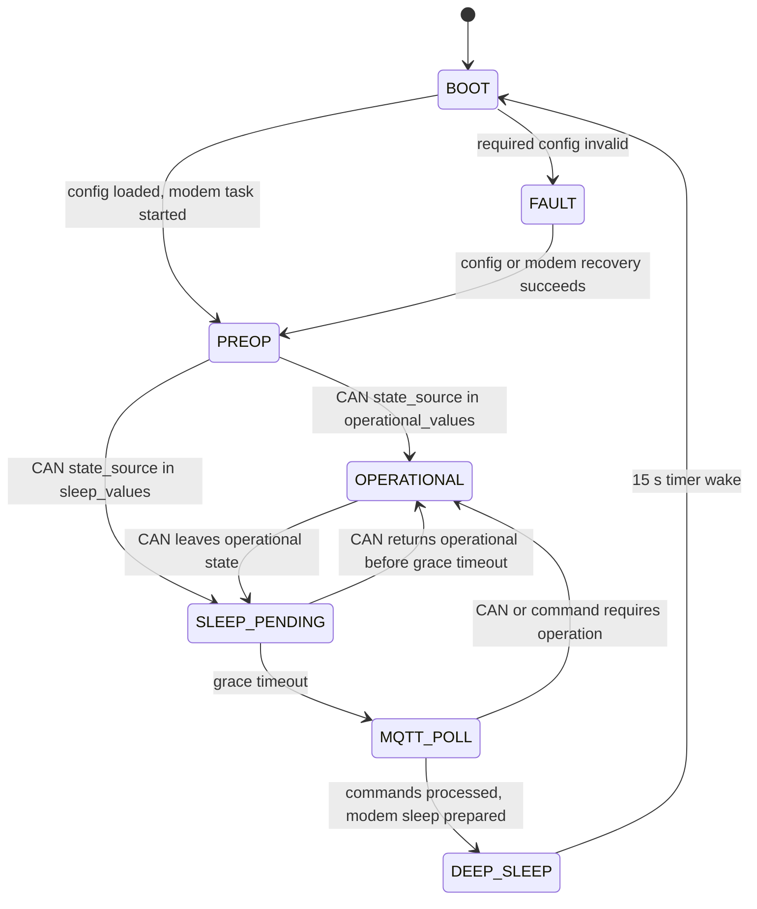
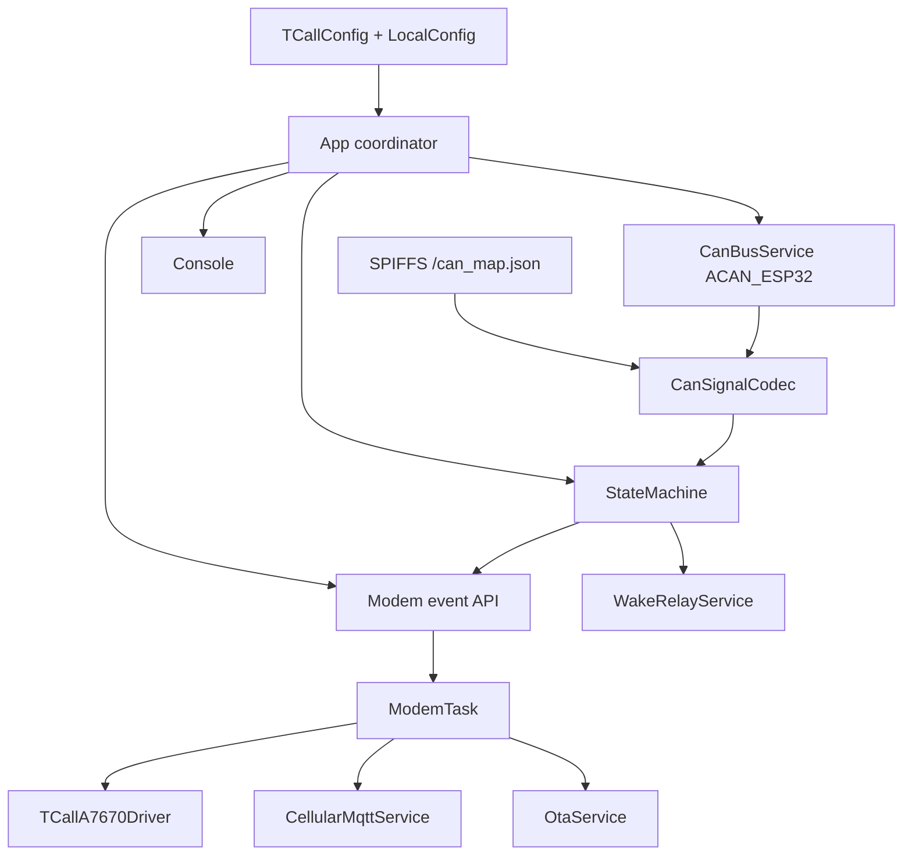

# T-Call A7670 v1.0 GSM/GNSS Firmware

PlatformIO firmware for the LilyGo T-Call A7670 v1.0 on `COM12`. It provides a USB
serial console, WiFi TCP console, OTA firmware upload, GSM/LTE data proof, GitHub
latest-release LTE OTA demo commands, SMS commands, and GNSS helpers for the SIMCom
A7670 family via `lewisxhe/TinyGSM-fork`.

`Inputs/` is local reference material only and is ignored by git. The active firmware is
under `src/`, and host helper scripts are under `tools/`.

## Table of Contents

- [Private Configuration](#private-configuration)
- [Build, Upload, Monitor](#build-upload-monitor)
- [Hardware](#hardware)
- [Productive Software Architecture](#productive-software-architecture)
  - [System Context](#system-context)
  - [Firmware Task Model](#firmware-task-model)
  - [Modem Event API](#modem-event-api)
  - [CAN to MQTT Data Flow](#can-to-mqtt-data-flow)
  - [DBC-Like CAN Mapping](#dbc-like-can-mapping)
  - [TCU State Machine](#tcu-state-machine)
  - [Production Module Boundaries](#production-module-boundaries)
- [Console](#console)
- [Proof Helpers](#proof-helpers)
- [Local NanoMQ Broker](#local-nanomq-broker)
- [MQTT over LTE with DuckDNS](#mqtt-over-lte-with-duckdns)

## Private Configuration

Copy the example config and fill in local values:

```powershell
Copy-Item src\LocalConfig.example.h src\LocalConfig.h
```

`src/LocalConfig.h` is ignored by git. Put WiFi, OTA hostname, SIM PIN, and APN values
there. Also set `TCALL_MQTT_HOST` to the static LAN IP or DNS name of your MQTT broker.
Set `TCALL_GPS_AUTOSTART` to `1` if the board should start the buffered GNSS runner
automatically and publish GPS cache values after boot.
Do not commit real passwords, SIM PINs, phone numbers, IMSI/ICCID/IMEI values, or proof
logs.

For the GitHub latest-release LTE OTA demo, configure:

```cpp
#define TCALL_GITHUB_OTA_OWNER "your-github-owner"
#define TCALL_GITHUB_OTA_REPO "your-github-repo"
#define TCALL_GITHUB_OTA_BIN_ASSET ""  // Empty selects the first .bin release asset.
#define TCALL_GITHUB_OTA_CRC_ASSET ""  // Empty selects <firmware>.crc32 or <firmware>.crc.
```

Publish each release with a firmware `.bin` asset and a CRC sidecar. The sidecar must
contain the expected 8-digit hex CRC32, for example:

```text
firmware.bin
firmware.bin.crc32
```

For production, give the broker host a DHCP reservation or static IP address in your
router, then use that stable address in `TCALL_MQTT_HOST`.

OTA upload passwords should be supplied locally:

```powershell
$env:TCALL_OTA_PASSWORD="your-ota-password"
pio run -e tcall_a7670_v1_0_ota -t upload --upload-flags "--auth=$env:TCALL_OTA_PASSWORD"
```

If mDNS does not resolve:

```powershell
pio run -e tcall_a7670_v1_0_ota -t upload --upload-port <board-ip-address> --upload-flags "--auth=$env:TCALL_OTA_PASSWORD"
```

## Build, Upload, Monitor

```powershell
pio run -e tcall_a7670_v1_0
pio run -e tcall_a7670_v1_0 -t upload
pio device monitor -p COM12 -b 115200
```

The first firmware load must be done over USB. After WiFi is configured, OTA can be used.
If OTA fails after a bad firmware image, recover with USB.

## Hardware

Target board: LilyGo T-Call A7670 v1.0. The v1.1 board uses different pins.

| Signal | GPIO |
| --- | ---: |
| Modem DTR | 14 |
| Modem TX | 26 |
| Modem RX | 25 |
| Modem PWRKEY | 4 |
| Board LED | 12 |
| Modem RING | 13 |
| Modem RESET | 27 |
| RESET active level | LOW |
| GNSS enable GPIO | -1 |

GNSS is built into A7670E-FASE and A7670SA-FASE variants. Use an active GNSS antenna
with sky view.

## Productive Software Architecture

The productive firmware is designed as a telematics control unit that bridges vehicle
CAN data to MQTT over LTE, accepts interpreted MQTT commands, can wake the vehicle
through a relay output, and manages low-power operation from a CAN-defined vehicle
state. The architecture keeps all modem UART and TinyGSM access inside one task so the
main application, CAN processing, console, and future state-machine logic stay
responsive while LTE registration, MQTT reconnects, OTA downloads, SMS, HTTP, or GNSS
operations are running.

### System Context



Default production wiring:

| Function | Default |
| --- | --- |
| CAN bitrate | `500000` |
| CAN TX | `GPIO32` |
| CAN RX | `GPIO33` |
| Wake relay output | `GPIO23`, active-high |
| MQTT transport | Cellular only |
| Sleep poll interval | `15000 ms` |

The CAN transceiver must be 3.3 V logic compatible. The relay output must drive a relay
driver or protected module, not a vehicle load directly.

### Firmware Task Model



Ownership rules:

- Only `ModemTask` may access `SerialAT`, `TinyGsm`, `TinyGsmClient`,
  `TinyGsmClientSecure`, modem reset, modem power key, and modem DTR.
- Other modules communicate with the modem through command and event queues.
- CAN decoding, state decisions, relay output, and local status caches remain outside
  the modem task.
- Cellular MQTT lives in `ModemTask` because it uses the modem socket client.
- WiFi remains available for local console and OTA development, but production MQTT is
  cellular-only.

### Modem Event API

The app submits modem work as commands with a `requestId`, timeout, and payload. The
modem task emits events that can be routed to the console, state machine, MQTT status
publisher, or OTA workflow.



Initial command set:

| Command | Purpose |
| --- | --- |
| `START` / `RESET` | Initialize or restart the modem hardware and UART |
| `RAW_AT` | Debug AT command with bounded timeout |
| `DATA_UP` / `DATA_DOWN` | Control LTE PDP data session |
| `MQTT_CONNECT` / `MQTT_DISCONNECT` | Manage broker connection |
| `MQTT_PUBLISH` | Publish telemetry, CAN signals, status, command results |
| `MQTT_SUBSCRIBE` | Subscribe to command topics after reconnect |
| `GPS_ENABLE` / `GPS_DISABLE` / `GPS_POLL` | Keep GNSS asynchronous |
| `HTTP_GET` | Diagnostic HTTP proof over LTE |
| `OTA_LATEST` / `OTA_UPDATE` | GitHub release lookup and LTE firmware update |
| `SMS_LIST` / `SMS_SEND` | SMS diagnostics without blocking the app loop |

Initial event set:

| Event | Meaning |
| --- | --- |
| `MODEM_ONLINE` / `MODEM_OFFLINE` | AT reachability changed |
| `DATA_READY` / `DATA_DOWN` | LTE data state changed |
| `MQTT_CONNECTED` / `MQTT_DISCONNECTED` | Broker state changed |
| `MQTT_MESSAGE` | Inbound command payload received |
| `MQTT_PUBLISHED` | Publish completed or failed |
| `GPS_FIX` / `GPS_ERROR` | GNSS cache update |
| `RAW_AT_RESULT` | Debug AT response |
| `OTA_PROGRESS` / `OTA_RESULT` | OTA download, CRC, and commit result |
| `JOB_TIMEOUT` / `ERROR` | Bounded failure for any long modem job |

### CAN to MQTT Data Flow



MQTT topics under `TCALL_MQTT_TOPIC_PREFIX`:

| Topic | Direction | Payload |
| --- | --- | --- |
| `/status` | publish | Device, modem, MQTT, CAN, sleep, and error state |
| `/gps` | publish | Last GNSS cache |
| `/can/<frame_name>` | publish | Decoded values for one received CAN frame |
| `/signals` | publish | Aggregated signal cache snapshot |
| `/cmd/can` | subscribe | Interpreted CAN command JSON |
| `/cmd/relay` | subscribe | Wake relay pulse or state command |
| `/cmd/system` | subscribe | Future restart, status refresh, OTA, or diagnostics commands |
| `/result/<command_id>` | publish | Command acknowledgement or failure |

Commands use interpreted JSON instead of raw CAN bytes in the first production design:

```json
{
  "command_id": "wake-001",
  "frame": "vehicle_command",
  "signals": {
    "wake_request": 1
  }
}
```

The firmware stores the last processed `command_id` values for retained MQTT commands so
a wake or CAN command is not replayed after every 15 second sleep poll.

### DBC-Like CAN Mapping

The firmware loads `/can_map.json` from SPIFFS. It is intentionally smaller than a full
DBC file but keeps the fields needed for deterministic decoding and encoding.

```json
{
  "bitrate": 500000,
  "state_source": {
    "signal": "vehicle_power_mode",
    "operational_values": [2, 3],
    "sleep_values": [0, 1]
  },
  "frames": [
    {
      "name": "vehicle_state",
      "id": 291,
      "extended": false,
      "dlc": 8,
      "signals": [
        {
          "name": "vehicle_power_mode",
          "start_bit": 0,
          "length": 8,
          "endian": "little",
          "signed": false,
          "scale": 1,
          "offset": 0,
          "unit": "state"
        }
      ]
    }
  ]
}
```

Mapping rules:

- `id` is the arbitration ID in decimal.
- `extended=false` means 11-bit CAN ID; `extended=true` means 29-bit CAN ID.
- `start_bit`, `length`, `endian`, `signed`, `scale`, and `offset` define physical
  value conversion.
- `state_source.signal` is the only source of the TCU operational state.
- Unknown frames may be counted and reported in `/status`, but they are not published as
  interpreted telemetry.

### TCU State Machine



State behavior:

| State | Behavior |
| --- | --- |
| `BOOT` | Start serial console, load config, mount SPIFFS, start ModemTask |
| `PREOP` | CAN and modem status are available, but vehicle is not operational |
| `OPERATIONAL` | Full CAN RX/TX, MQTT publish, command handling, GNSS, diagnostics |
| `SLEEP_PENDING` | Wait grace period after CAN state leaves operational mode |
| `MQTT_POLL` | Bring LTE/MQTT up briefly, process retained commands, publish status |
| `DEEP_SLEEP` | Put A7670 into sleep, set ESP32 timer wakeup, stop application loop |
| `FAULT` | Stay awake for debugging; do not transmit CAN unless config is valid |

Deep sleep policy:

- The CAN `state_source` decides whether the vehicle is operational.
- If the vehicle is not operational, the firmware enters sleep after a grace period.
- The ESP32 wakes every `15000 ms`, wakes the modem, reconnects MQTT, processes retained
  commands, publishes status, and returns to sleep unless CAN state requires operation.
- Before sleep, the relay output is driven LOW and modem sleep is prepared with DTR and
  sleep AT commands.

### Production Module Boundaries



Module responsibilities:

| Module | Responsibility |
| --- | --- |
| `CanBusService` | ACAN_ESP32 setup, frame RX/TX queues, bus error counters |
| `CanSignalCodec` | Load JSON mapping, decode frames, encode interpreted commands |
| `TcuStateMachine` | Decide operation, sleep, fault, and MQTT poll windows |
| `WakeRelayService` | Pulse or set the vehicle wake relay output safely |
| `ModemTask` | Serialize all modem UART, TinyGSM, Cellular MQTT, GNSS, OTA work |
| `CellularMqttService` | Topic subscription, publish queue, reconnect policy |
| `CommandDeduplicator` | Prevent retained MQTT commands from replaying by `command_id` |
| `ConsoleService` | USB/WiFi command handling without blocking modem or CAN work |

## Console

Open USB serial at `115200`, or connect to the WiFi TCP console on port `23`:

```powershell
python tools\wifi_console.py <board-ip-or-hostname>
python tools\wifi_console.py <board-ip-or-hostname> -c "wifi status"
```

Commands:

```text
help
diag
at <cmd>
sim [status|pin-off]
sms list [all|unread|read]
sms send <number> <message>
reg
operator auto|telekom|status
rat auto|lte
data up|down|status
mqtt status|publish
ota config|latest|update
gsm prove [timeout_seconds] [host] [path]
gsm reset
http <host> [path]
gps on|off|raw|fix|ex|cache|prove [timeout_seconds]|hot|cold|status
wifi status
```

`sms send` handles the `AT+CMGS` prompt and Ctrl-Z terminator internally. Use it instead
of raw `at +CMGS...`.

`mqtt status` shows broker configuration and connection state. `mqtt publish` immediately
publishes the retained JSON payloads:

```text
<topic-prefix>/gps
<topic-prefix>/status
```

`ota latest` brings up LTE data if needed, queries GitHub's latest release over HTTPS,
and prints the selected firmware and CRC assets. `ota update` performs the same latest
release lookup, downloads the CRC sidecar, streams the `.bin` over LTE into the ESP32 OTA
partition, calculates CRC32 while writing, and commits/reboots only if the CRC matches.

`gsm prove` waits for LTE/EPS registration, activates PDP data using the locally
configured APN, fetches an HTTP page through the modem, and prints `GSM PROOF PASS` only
after bytes are received from the web server.

`gps on` starts GNSS and enables the buffered GPS runner. `gps off` stops the runner so
GSM tests have exclusive use of the modem UART.

## Proof Helpers

```powershell
python tools\proof\gsm_proof.py <board-ip-or-hostname> --timeout 180
python tools\proof\gps_proof.py <board-ip-or-hostname> --timeout 900
```

Proof logs are written under `logs/`, which is ignored by git because logs can contain
network names, phone numbers, modem identifiers, and location data.

## Local NanoMQ Broker

Download NanoMQ for Windows into the ignored local broker directory:

```powershell
New-Item -ItemType Directory -Force -Path tools\mqtt_broker\nanomq
Invoke-WebRequest -Uri https://github.com/nanomq/nanomq/releases/download/0.24.14/nanomq-0.24.14-windows-x86_64.zip -OutFile tools\mqtt_broker\nanomq\nanomq.zip
Expand-Archive tools\mqtt_broker\nanomq\nanomq.zip -DestinationPath tools\mqtt_broker\nanomq -Force
```

Start NanoMQ:

```powershell
.\tools\mqtt_broker\start_nanomq.ps1
```

The script prints local IPv4 addresses. Use the stable LAN address as `TCALL_MQTT_HOST`.
Default listener: `0.0.0.0:1883`.

Receive MQTT telemetry:

```powershell
python tools\test\mqtt_subscribe.py 127.0.0.1 --topic "tcall/a7670/v10/#" --timeout 120 --count 2 --log logs\mqtt-test.log
```

Self-test the broker and client without the board:

```powershell
python tools\test\mqtt_subscribe.py 127.0.0.1 --topic "tcall/a7670/v10/#" --self-test --count 1
```

When the firmware is configured with `TCALL_MQTT_HOST` and WiFi is connected, the board
publishes retained JSON telemetry to:

```text
tcall/a7670/v10/gps
tcall/a7670/v10/status
```

## MQTT over LTE with DuckDNS

DuckDNS gives the home MQTT broker a stable DNS name, but LTE access also requires that
the broker is reachable from the public internet.

1. Create a DuckDNS subdomain and token at `duckdns.org`.
2. Copy the local env template and fill in private values:

```powershell
Copy-Item tools\dyndns\duckdns.env.example tools\dyndns\duckdns.env
notepad tools\dyndns\duckdns.env
```

`duckdns.env` is ignored by git.

3. Update DuckDNS from this PC:

```powershell
.\tools\dyndns\update_duckdns.ps1
```

Optionally install an automatic Windows Scheduled Task that updates DuckDNS every
5 minutes:

```powershell
.\tools\dyndns\install_duckdns_task.ps1
```

4. In the router, forward external TCP `1883` to the MQTT broker PC, currently
`192.168.3.2:1883`. Give the PC a DHCP reservation so this LAN address stays stable.
5. Allow inbound TCP `1883` in Windows Firewall for the NanoMQ broker.
6. Test from outside the LAN, for example through a phone hotspot:

```powershell
.\tools\test\test_mqtt_endpoint.ps1 -HostName your-subdomain.duckdns.org -Port 1883
python tools\test\mqtt_subscribe.py your-subdomain.duckdns.org --topic "tcall/a7670/v10/#" --timeout 60 --count 2
```

For a real modem/LTE publish test, set these local firmware values in `src\LocalConfig.h`,
then upload by USB or OTA:

```cpp
#define TCALL_MQTT_HOST "your-subdomain.duckdns.org"
#define TCALL_MQTT_TRANSPORT "cellular"
#define TCALL_MQTT_PORT 1883
```

Bring up cellular data and publish:

```powershell
python tools\wifi_console.py tcall-a7670-v10.local -c "data up"
python tools\wifi_console.py tcall-a7670-v10.local -c "mqtt status"
python tools\wifi_console.py tcall-a7670-v10.local -c "mqtt publish"
```

For production, prefer MQTT over TLS on port `8883` with broker authentication. The
plain `1883` setup is useful for field testing but should not remain anonymous on the
public internet.
